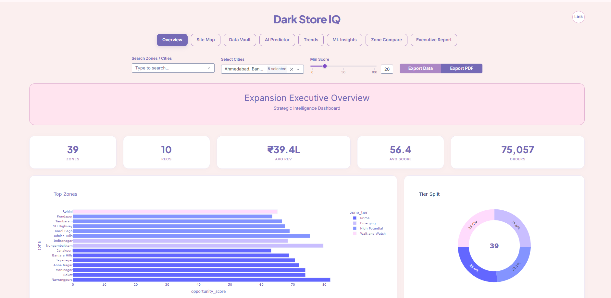
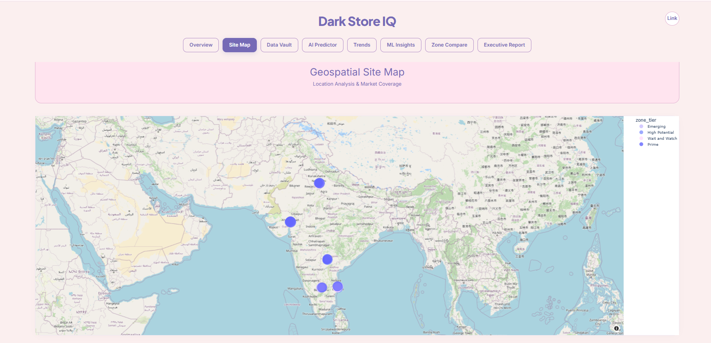
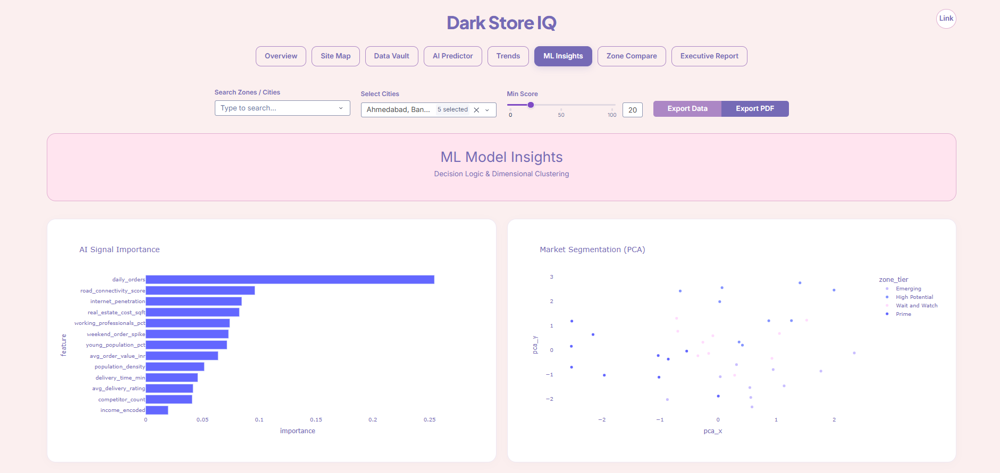

<div align="center">

# Dark Store IQ — Site Intelligence & Expansion Analytics

### A Production-Grade, End-to-End Location Intelligence System for Quick Commerce

**10-city simulated zone dataset (SQLite) · ML scoring (0–100) · Open/No-Open recommendations · Tier segmentation (KMeans) · Geospatial map · Trends · Zone comparator · Exportable data vault · Printable executive report · Interactive Dash UI**

<br/>

[Quick Start](#quick-start) &nbsp;·&nbsp; [Key Results](#key-results) &nbsp;·&nbsp; [Architecture](#architecture) &nbsp;·&nbsp; [Tech Stack](#tech-stack) &nbsp;·&nbsp; [Project Structure](#project-structure) &nbsp;·&nbsp; [Dashboard Pages](#dashboard-pages) &nbsp;·&nbsp; [ML Deep Dive](#ml-deep-dive) &nbsp;·&nbsp; [Screenshots](#screenshots) &nbsp;·&nbsp; [Troubleshooting](#troubleshooting)

---

</div>

## Overview

**Business Question:** *Where should a quick-commerce company open its next dark store — and how confident are we?*

Dark Store IQ is an end-to-end analytics + ML application that generates a **simulated operational quick-commerce market dataset**, trains models, and launches a **decision-grade dashboard** for expansion planning. It helps teams evaluate zones using a blend of demand signals, operational feasibility metrics, competitive pressure, and socioeconomic indicators.

This is not just a UI—this repo includes:
- a **SQLite “analytics warehouse”**
- a **model training pipeline** that exports reusable artifacts (`.pkl`)
- a **Dash dashboard** with multiple decision workflows (map, predictor, compare, executive report)

---

## Key Results

<div align="center">

| Metric | What You Get |
|:---|:---:|
| Output | **Open / Don’t open recommendation** + **Opportunity Score (0–100)** |
| ML Models | **Random Forest (classifier)** · **Gradient Boosting (regressor)** |
| Segmentation | **KMeans (4 tiers)** + PCA-based 2D visual segmentation |
| Decision Workflows | Map · Data Vault · AI Predictor · Trends · ML Insights · Zone Compare · Executive Report |
| Exports | Filtered CSV export + print-ready report pages |

</div>

> Note: This project generates **simulated operational quick-commerce market data** (so it runs immediately without private company data).

---

## Architecture

```text
+---------------------------------------------------------------------+
|                         DATA + MODEL ARTIFACTS                       |
|   Simulated Zone Data (Cities)  ·  Trends  ·  Feature Importance     |
|                SQLite Warehouse: data/darkstore.db                   |
+-------------------------------+-------------------------------------+
                                |
                                v
                +------------------------------+
                | Stage 01 — Data Generation   |
                | - Simulated zone-level data  |
                | - Monthly trends             |
                | - Writes SQLite tables       |
                +---------------+--------------+
                                |
                                v
                +------------------------------+
                | Stage 02 — ML Training       |
                | - Feature scaling            |
                | - Classifier (RF)            |
                | - Regressor (GB)             |
                | - Clustering (KMeans)        |
                | - PCA projection             |
                | - Exports .pkl artifacts     |
                +---------------+--------------+
                                |
                                v
                +------------------------------+
                | Stage 03 — Dash Application  |
                | - Map + tiers                |
                | - AI predictor simulation    |
                | - Trends + insights          |
                | - Compare zones + pinning    |
                | - Executive report view      |
                +------------------------------+
```

---

## Tech Stack

<div align="center">

| Layer | Technology | Purpose |
|:---|:---|:---|
| Language | Python | Core logic |
| UI / App | Dash + Dash Bootstrap Components | Interactive web dashboard |
| Charts | Plotly | KPIs, trends, radar, map visualizations |
| Data | SQLite + Pandas | Zone tables, trend tables, feature importance |
| ML | Scikit-learn | Classification, regression, clustering, scaling |
| Serving (optional) | Gunicorn | Production deployment |

</div>

---

## Quick Start

### Prerequisites
- Python **3.9+**
- pip

### 1) Install
```bash
pip install -r requirements.txt
```

### 2) Generate the database
Creates/updates the SQLite warehouse at `data/darkstore.db`.

```bash
python data/generate_data.py
```

### 3) Train models
Creates/updates the model artifacts in `models/`:

```bash
python models/train.py
```

### 4) Launch the dashboard
```bash
python app.py
```

Open: **http://127.0.0.1:8050**

---

## Project Structure

```text
Dark-Store-IQ/
|
+-- data/
|   +-- generate_data.py              <- Simulated operational data generator
|   +-- darkstore.db                  <- SQLite warehouse (generated)
|
+-- models/
|   +-- train.py                      <- ML training pipeline
|   +-- classifier.pkl                <- Random Forest classifier
|   +-- regressor.pkl                 <- Gradient Boosting regressor
|   +-- scaler.pkl                    <- Feature scaler
|   +-- label_encoder.pkl             <- Encoder for predictor input
|   +-- kmeans.pkl                    <- 4-tier segmentation model
|
+-- app.py                            <- Dash app (UI + callbacks)
+-- requirements.txt
+-- README.md
```

---

## Dashboard Pages

Inside the UI you’ll find:

- **Overview**: executive KPIs, top zones ranking, tier split  
- **Site Map**: geospatial view of zones and tiers  
- **Data Vault**: filterable table + CSV export  
- **AI Predictor**: what-if simulation (inputs → recommendation + confidence + score gauge)  
- **Trends**: monthly city-level demand patterns  
- **ML Insights**: feature importance + PCA segmentation plot  
- **Zone Compare**: KPI benchmark + radar chart + pin favorites  
- **Executive Report**: print-ready summary with top strategic sites and ROI-style metrics  

---

## ML Deep Dive

### Models
- **Classifier**: Random Forest → predicts whether a zone should host a dark store
- **Regressor**: Gradient Boosting → predicts an opportunity score (0–100)
- **Clusterer**: KMeans (4 clusters) → assigns zone tiers
- **PCA**: used for 2D visualization of segmentation

### Signals / Inputs (high-level)
The system uses demand, competition, operations, and demographic signals such as:
- population density, daily orders, avg order value (AOV)
- competitor density, road connectivity
- delivery rating, delivery time
- internet penetration
- real-estate cost
- income band / demographics
- weekend spikes + trend patterns

---

## Screenshots

<div align="center">

### Overview


### Site Map


### ML Insights


</div>

---

## Troubleshooting

### App shows: “Data missing.”
This means the app couldn’t load the SQLite DB or required tables.

Fix:
```bash
python data/generate_data.py
python models/train.py
python app.py
```

### Missing model files in `models/`
Run:
```bash
python models/train.py
```

### Port already in use
Change the port in `app.py`:
```python
app.run(debug=False, port=8051)
```

---

## Connect

Built by **Jiya**

- GitHub: https://github.com/JIYA1220
- LinkedIn:https://www.linkedin.com/in/jiya-sharma-394565338

---

*If this project was useful to you, consider starring the repository.*
